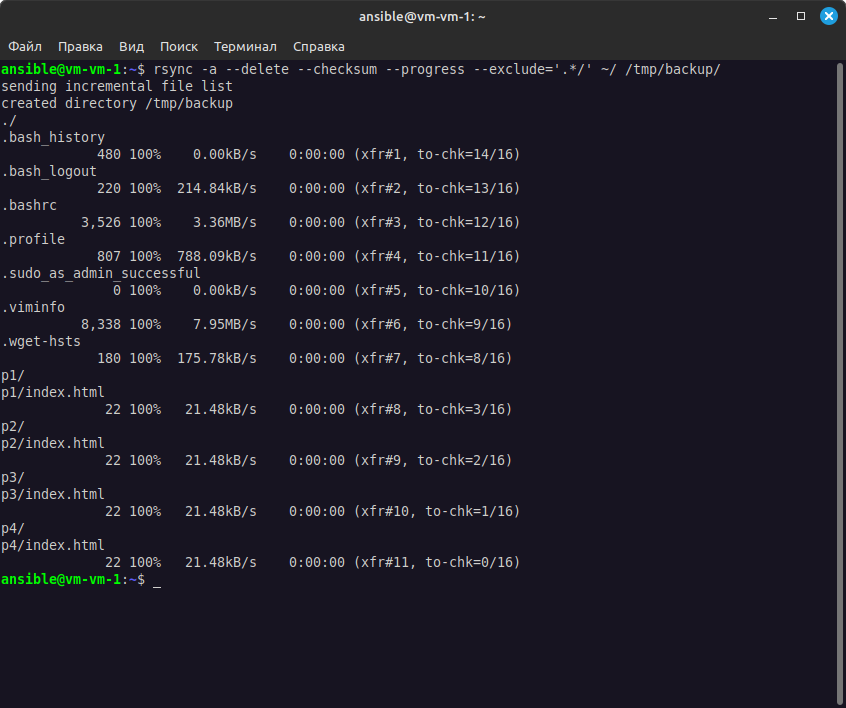
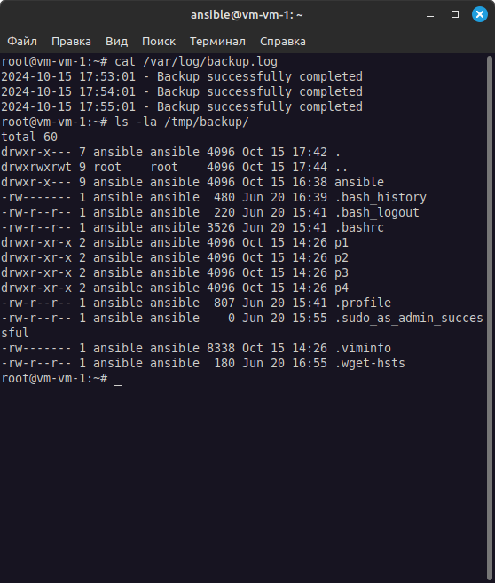
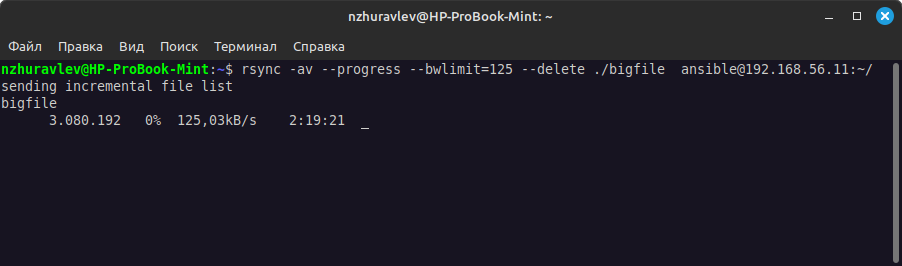

# Домашнее задание к занятию "`Резервное копирование`" - `Журавлев Николай`

### Задание 1
- Составьте команду rsync, которая позволяет создавать зеркальную копию домашней директории пользователя в директорию `/tmp/backup`
- Необходимо исключить из синхронизации все директории, начинающиеся с точки (скрытые)
- Необходимо сделать так, чтобы rsync подсчитывал хэш-суммы для всех файлов, даже если их время модификации и размер идентичны в источнике и приемнике.
- На проверку направить скриншот с командой и результатом ее выполнения

### Решение 1

`rsync -a --delete --checksum --exclude='.*/' ~/ /tmp/backup/`



---

### Задание 2
- Написать скрипт и настроить задачу на регулярное резервное копирование домашней директории пользователя с помощью rsync и cron.
- Резервная копия должна быть полностью зеркальной
- Резервная копия должна создаваться раз в день, в системном логе должна появляться запись об успешном или неуспешном выполнении операции
- Резервная копия размещается локально, в директории `/tmp/backup`
- На проверку направить файл crontab и скриншот с результатом работы утилиты.

### Решение 2

#### Файл скрипта
```bash
#!/bin/bash

SOURCE_DIR="/home/ansible"
BACKUP_DIR="/tmp/backup"
LOG_FILE="/var/log/backup.log"

rsync -a --delete $SOURCE_DIR $BACKUP_DIR >> $LOG_FILE 2>&1

if [ $? -eq 0 ]; then
  echo "$(date '+%Y-%m-%d %H:%M:%S') - Backup successfully completed" >> $LOG_FILE
else
  echo "$(date '+%Y-%m-%d %H:%M:%S') - Backup failed" >> $LOG_FILE
fi
```

#### Задание cron
```
0 0 * * * root /root/backup
```

Временно настроил на ежеминутное срабатывание, чтобы получить лог. На скриншоте видно содержимое лога и содержимое папки с бэкапом.



---

### Задание 3*
- Настройте ограничение на используемую пропускную способность rsync до 1 Мбит/c
- Проверьте настройку, синхронизируя большой файл между двумя серверами
- На проверку направьте команду и результат ее выполнения в виде скриншота

### Решение 3*

```bash
rsync -av --progress --bwlimit=125 --delete ./bigfile  ansible@192.168.56.11:~/
# 125 КБайт/с эквивалентно 1 Мбит/с
```


---

### Задание 4*
- Напишите скрипт, который будет производить инкрементное резервное копирование домашней директории пользователя с помощью rsync на другой сервер
- Скрипт должен удалять старые резервные копии (сохранять только последние 5 штук)
- Напишите скрипт управления резервными копиями, в нем можно выбрать резервную копию и данные восстановятся к состоянию на момент создания данной резервной копии.
- На проверку направьте скрипт и скриншоты, демонстрирующие его работу в различных сценариях.

### Решение 4*

---
