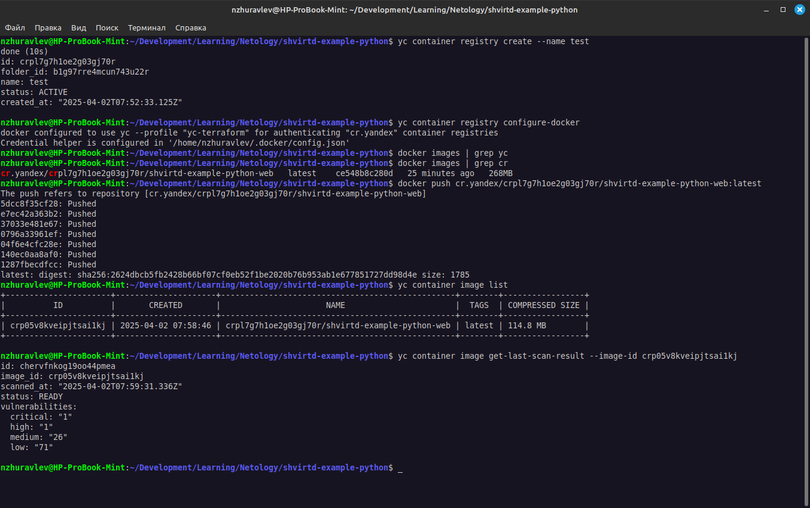
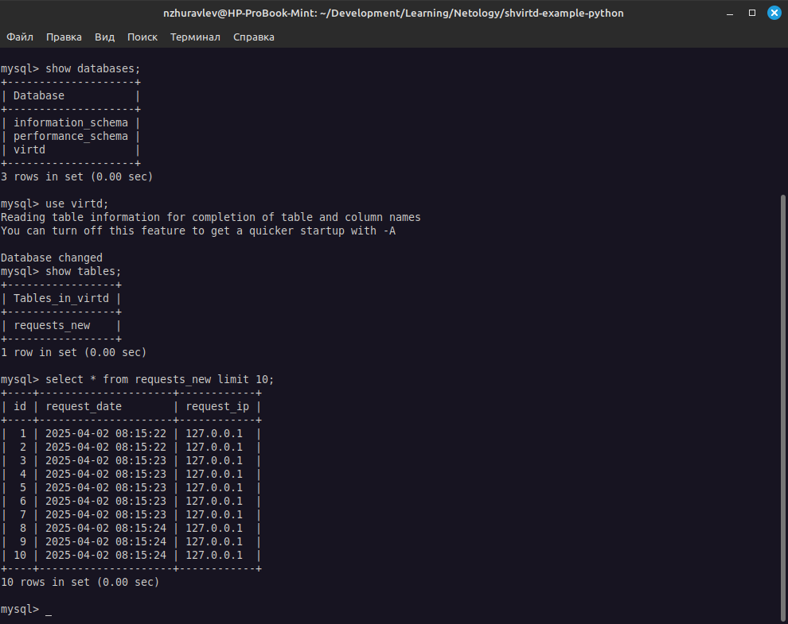
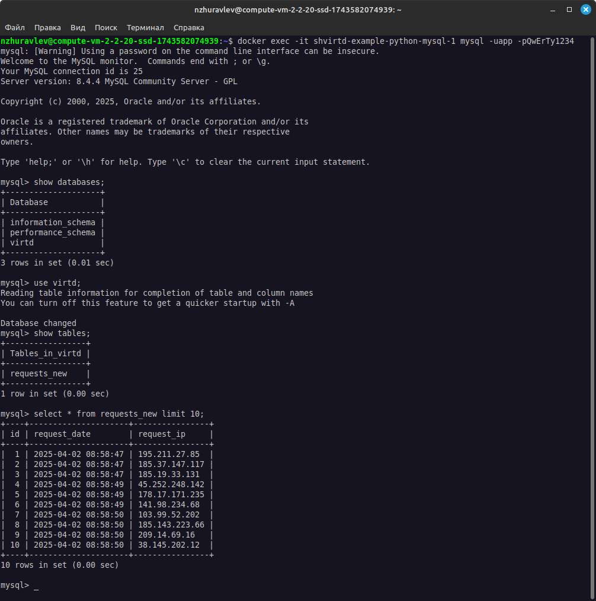
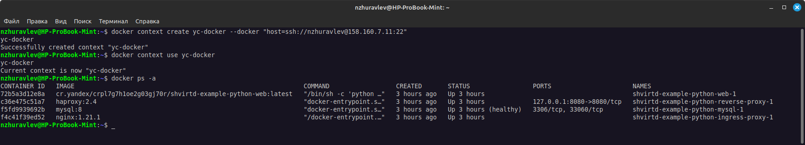
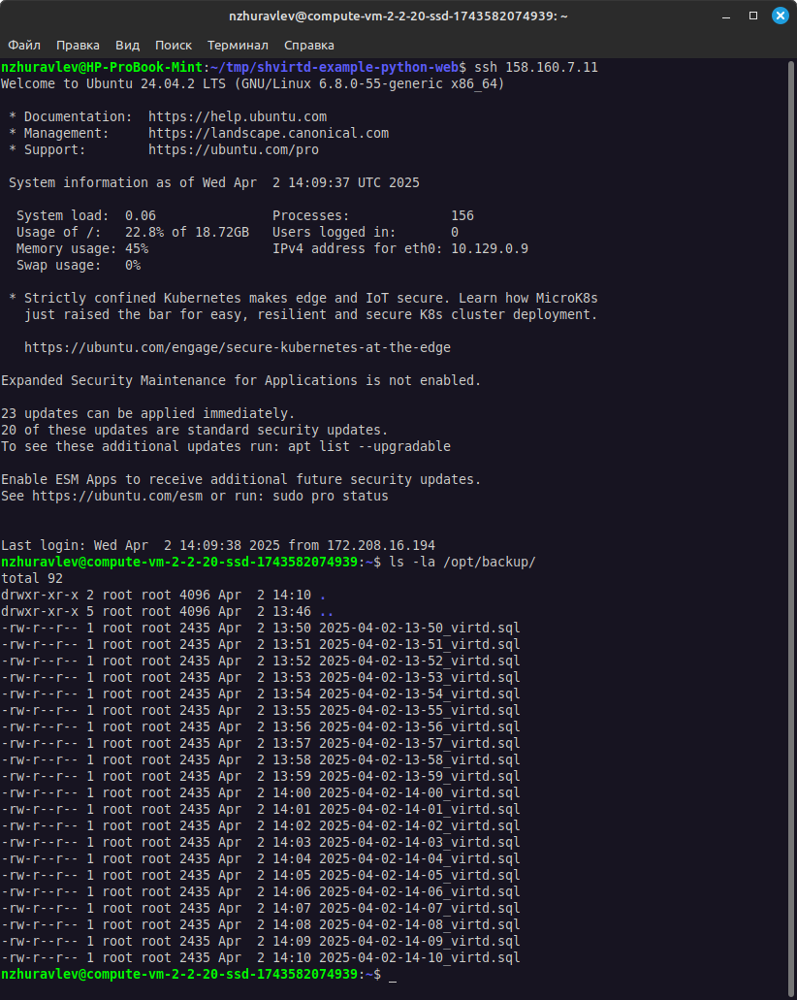
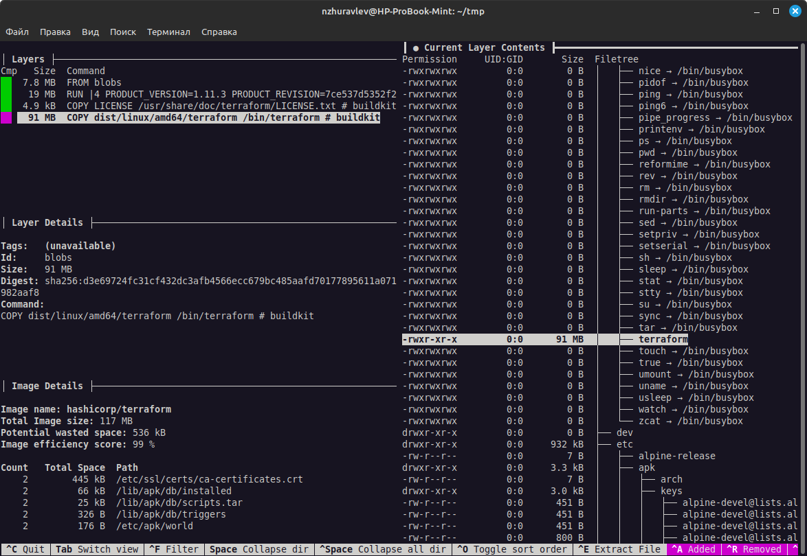
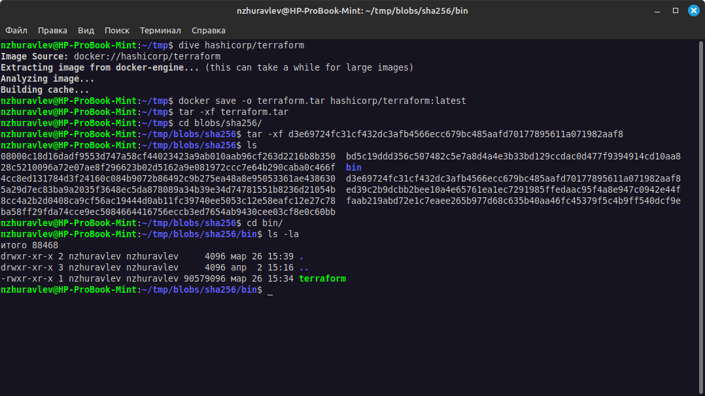
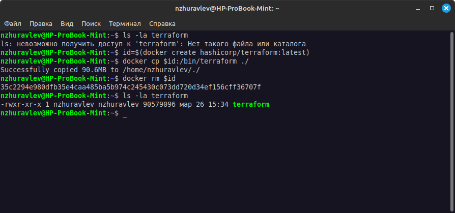
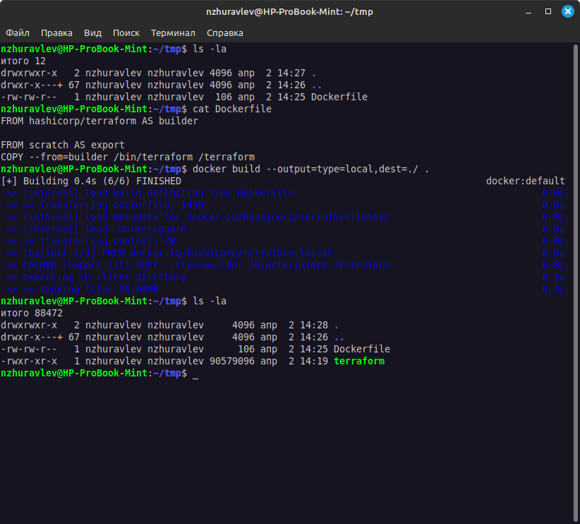
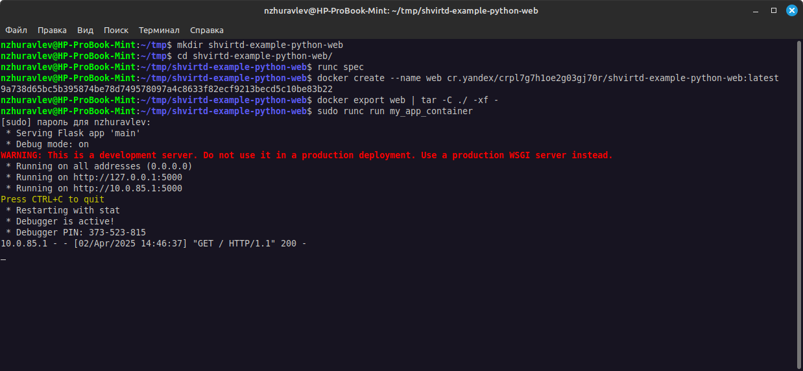

# Домашнее задание к занятию "`Практическое применение Docker`" - `Журавлев Николай`

## Задача 0
1. Убедитесь что у вас НЕ(!) установлен ```docker-compose```, для этого получите следующую ошибку от команды ```docker-compose --version```
```
Command 'docker-compose' not found, but can be installed with:

sudo snap install docker          # version 24.0.5, or
sudo apt  install docker-compose  # version 1.25.0-1

See 'snap info docker' for additional versions.
```
В случае наличия установленного в системе ```docker-compose``` - удалите его.  
2. Убедитесь что у вас УСТАНОВЛЕН ```docker compose```(без тире) версии не менее v2.24.X, для это выполните команду ```docker compose version```  
###  **Своё решение к задачам оформите в вашем GitHub репозитории!!!!!!!!!!!!!!!!!!!!!!!!!!!!!!!!**

---

## Задача 1
1. Сделайте в своем github пространстве fork [репозитория](https://github.com/netology-code/shvirtd-example-python/blob/main/README.md).
   Примечание: В связи с доработкой кода python приложения. Если вы уверены что задание выполнено вами верно, а код python приложения работает с ошибкой то используйте вместо main.py файл not_tested_main.py(просто измените CMD)
3. Создайте файл с именем ```Dockerfile.python``` для сборки данного проекта(для 3 задания изучите https://docs.docker.com/compose/compose-file/build/ ). Используйте базовый образ ```python:3.9-slim```. 
Обязательно используйте конструкцию ```COPY . .``` в Dockerfile. Не забудьте исключить ненужные в имадже файлы с помощью dockerignore. Протестируйте корректность сборки.  
4. (Необязательная часть, *) Изучите инструкцию в проекте и запустите web-приложение без использования docker в venv. (Mysql БД можно запустить в docker run).
5. (Необязательная часть, *) По образцу предоставленного python кода внесите в него исправление для управления названием используемой таблицы через ENV переменную.

## Решение 1
Ссылка на репозиторий - https://github.com/zhuravlev-nik/shvirtd-example-python

В данном случае изначально сделал копирование не всей папки, а только нужных файлов, в данном случае проще копировать нужное, чем указывать множество исключений в `.dockerignore`, после переделал в соотвествии с заданием.
Название таблицы вынесено в переменную окружения.


---
### ВНИМАНИЕ!
!!! В процессе последующего выполнения ДЗ НЕ изменяйте содержимое файлов в fork-репозитории! Ваша задача ДОБАВИТЬ 5 файлов: ```Dockerfile.python```, ```compose.yaml```, ```.gitignore```, ```.dockerignore```,```bash-скрипт```. Если вам понадобилось внести иные изменения в проект - вы что-то делаете неверно!
---

## Задача 2 (*)
1. Создайте в yandex cloud container registry с именем "test" с помощью "yc tool" . [Инструкция](https://cloud.yandex.ru/ru/docs/container-registry/quickstart/?from=int-console-help)
2. Настройте аутентификацию вашего локального docker в yandex container registry.
3. Соберите и залейте в него образ с python приложением из задания №1.
4. Просканируйте образ на уязвимости.
5. В качестве ответа приложите отчет сканирования.

## Решение 2




---

## Задача 3
1. Изучите файл "proxy.yaml"
2. Создайте в репозитории с проектом файл ```compose.yaml```. С помощью директивы "include" подключите к нему файл "proxy.yaml".
3. Опишите в файле ```compose.yaml``` следующие сервисы: 

- ```web```. Образ приложения должен ИЛИ собираться при запуске compose из файла ```Dockerfile.python``` ИЛИ скачиваться из yandex cloud container registry(из задание №2 со *). Контейнер должен работать в bridge-сети с названием ```backend``` и иметь фиксированный ipv4-адрес ```172.20.0.5```. Сервис должен всегда перезапускаться в случае ошибок.
Передайте необходимые ENV-переменные для подключения к Mysql базе данных по сетевому имени сервиса ```web``` 

- ```db```. image=mysql:8. Контейнер должен работать в bridge-сети с названием ```backend``` и иметь фиксированный ipv4-адрес ```172.20.0.10```. Явно перезапуск сервиса в случае ошибок. Передайте необходимые ENV-переменные для создания: пароля root пользователя, создания базы данных, пользователя и пароля для web-приложения.Обязательно используйте уже существующий .env file для назначения секретных ENV-переменных!

4. Запустите проект локально с помощью docker compose , добейтесь его стабильной работы: команда ```curl -L http://127.0.0.1:8090``` должна возвращать в качестве ответа время и локальный IP-адрес. Если сервисы не стартуют воспользуйтесь командами: ```docker ps -a ``` и ```docker logs <container_name>``` . Если вместо IP-адреса вы получаете ```NULL``` --убедитесь, что вы шлете запрос на порт ```8090```, а не 5000.

5. Подключитесь к БД mysql с помощью команды ```docker exec -ti <имя_контейнера> mysql -uroot -p<пароль root-пользователя>```(обратите внимание что между ключем -u и логином root нет пробела. это важно!!! тоже самое с паролем) . Введите последовательно команды (не забываем в конце символ ; ): ```show databases; use <имя вашей базы данных(по-умолчанию example)>; show tables; SELECT * from requests LIMIT 10;```.

6. Остановите проект. В качестве ответа приложите скриншот sql-запроса.

## Решение 3



> Из правок, которых быть не должно, удалил только `version` из `proxy.yaml`, чтобы не выскакивало предупреждение, функциональной нагрузки данное изменение не несет.
---

## Задача 4
1. Запустите в Yandex Cloud ВМ (вам хватит 2 Гб Ram).
2. Подключитесь к Вм по ssh и установите docker.
3. Напишите bash-скрипт, который скачает ваш fork-репозиторий в каталог /opt и запустит проект целиком.
4. Зайдите на сайт проверки http подключений, например(или аналогичный): ```https://check-host.net/check-http``` и запустите проверку вашего сервиса ```http://<внешний_IP-адрес_вашей_ВМ>:8090```. Таким образом трафик будет направлен в ingress-proxy. ПРИМЕЧАНИЕ:  приложение main.py( в отличие от not_tested_main.py) весьма вероятно упадет под нагрузкой, но успеет обработать часть запросов - этого достаточно. Обновленная версия (main.py) не прошла достаточного тестирования временем, но должна справиться с нагрузкой.
5. (Необязательная часть) Дополнительно настройте remote ssh context к вашему серверу. Отобразите список контекстов и результат удаленного выполнения ```docker ps -a```
6. В качестве ответа повторите  sql-запрос и приложите скриншот с данного сервера, bash-скрипт и ссылку на fork-репозиторий.

## Решение 4

Ссылка на репозиторий - https://github.com/zhuravlev-nik/shvirtd-example-python

Скрипт написал простой (без использования git, в условиях задачи про установку git ничего не сказано), запускаться должен с правами суперпользователя. Каких-то дополнительных проверок не делал, запуск следующей команды осуществляется только после удачного завершения предыдущей.
```
#!/bin/bash
cd /opt/ &&
wget https://github.com/zhuravlev-nik/shvirtd-example-python/archive/refs/heads/main.zip &&
unzip main.zip &&
rm main.zip &&
cd shvirtd-example-python-main &&
docker compose up -d
```

Если возможно использование гита, то было бы так (если репозиторий публичный, как в нашем случае):

```
#!/bin/bash
cd /opt/ &&
git clone https://github.com/zhuravlev-nik/shvirtd-example-python.git &&
cd shvirtd-example-python &&
docker compose up -d

```



---

## Задача 5 (*)
1. Напишите и задеплойте на вашу облачную ВМ bash скрипт, который произведет резервное копирование БД mysql в директорию "/opt/backup" с помощью запуска в сети "backend" контейнера из образа ```schnitzler/mysqldump``` при помощи ```docker run ...``` команды. Подсказка: "документация образа."
2. Протестируйте ручной запуск
3. Настройте выполнение скрипта раз в 1 минуту через cron, crontab или systemctl timer. Придумайте способ не светить логин/пароль в git!!
4. Предоставьте скрипт, cron-task и скриншот с несколькими резервными копиями в "/opt/backup"

## Решение 5

Есть проблема mysql:8 не поддерживает авторизацию с использованием mysql_native_password, а в указанном образе нет плагина, позволяющего авторизоваться с использованием плагина caching_sha2_password.
Отсюда вижу три варианта решения проблемы:
1. Не использовать данный образ, а запускать mysqldump внутри самого контейнера
В таком случае скрипт довольно простой:
    ```bash
    #!/bin/bash
    now=$(date +"%Y-%m-%d-%H-%M")
    docker exec -it shvirtd-example-python-mysql-1 mysqldump --opt -hmysql -uapp -p"QwErTy1234" virtd > ${now}_virtd.sql
    ```
2. Использовать более старую версию mysql, которая поддерживает плагин mysql_native_password.
3. Создать свой образ на основе ```schnitzler/mysqldump``` - добавить необходимый плагин и использовать уже данный образ.

    В таком случае:
    * Создаем Dockerfile со следующим содержимым:
        ```
        FROM schnitzler/mysqldump
        RUN apk add mariadb-connector-c
        ```
    * Собираем образ `docker build -t my-mysqldump:latest .` (если нееобходимо, загражаем его в реестр)
    * Пишем скрипт примерно следующего содержания:
        ```bash
        #!/bin/bash
        now=$(date +"%Y-%m-%d-%H-%M")
        docker run --rm --entrypoint "" \
          -v /opt/backup:/backup \
          --network="shvirtd-example-python_backend" \
          my-mysqldump \
          mysqldump --opt -hmysql -uroot -p${1} --result-file=/backup/${now}_virtd.sql virtd
        ```
    * Запускаем этот скрипт (вручную или другим способом)
    * Чтобы "не светить" пароль в git, можем передавать его при запуске скрипта в качестве параметра. В нашем случае пароль будет находится в строке запуска в кроне.
      ```bash
      # m h  dom mon dow   command
      * * * * * /usr/local/bin/mysql-backup YtReWq4321
      ```

---

## Задача 6
Скачайте docker образ ```hashicorp/terraform:latest``` и скопируйте бинарный файл ```/bin/terraform``` на свою локальную машину, используя dive и docker save.
Предоставьте скриншоты  действий.

## Решение 6


---

## Задача 6.1
Добейтесь аналогичного результата, используя docker cp.  
Предоставьте скриншоты  действий.

## Решение 6.1

---

## Задача 6.2 (**)
Предложите способ извлечь файл из контейнера, используя только команду docker build и любой Dockerfile.  
Предоставьте скриншоты действий.

## Решение 6.2

---

## Задача 7 (***)
Запустите ваше python-приложение с помощью runC, не используя docker или containerd.  
Предоставьте скриншоты  действий .

## Решение 7


В конфиге была изменена конфигурация процесса, указаны необходимые пути.
База данных запущена в docker-контейнере с проборосм порта наружу (на хостовую машину), сервисы nginx и haproxy не подключены, для подключения в текущей ситуации достаточно изменить конфиг haproxy (поменять адрес бэкенда на необходимый)

```
"args": ["python3", "/app/main.py"],
"cwd": "/home/nzhuravlev/tmp/shvirtd-example-python-web/",
"env": [
  "DB_NAME=virtd",
  "DB_USER=app",
  "DB_PASSWORD=QwErTy1234",
  "DB_HOST=192.168.1.20",
  "PATH=/usr/local/sbin:/usr/local/bin:/usr/sbin:/usr/bin:/sbin:/bin"
],
```

---