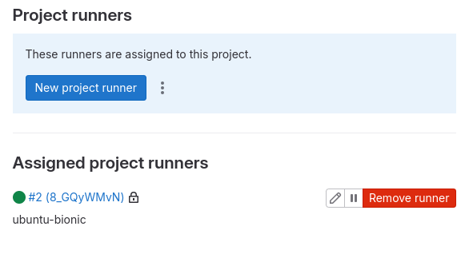
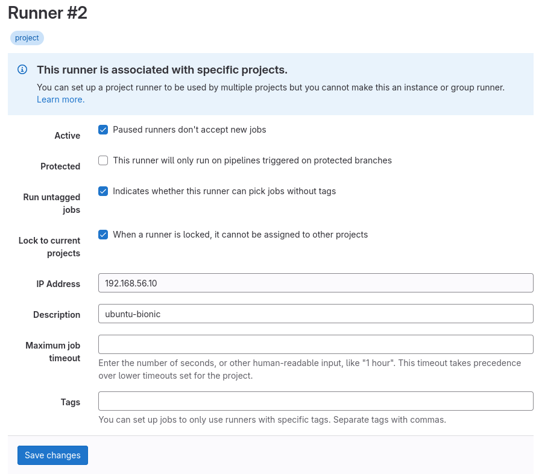
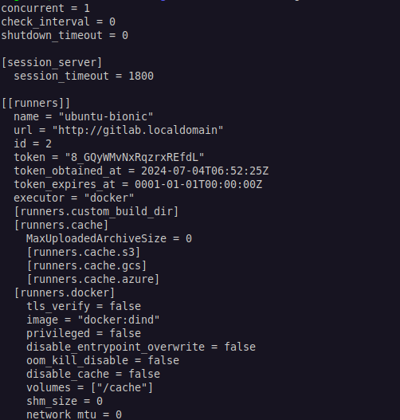
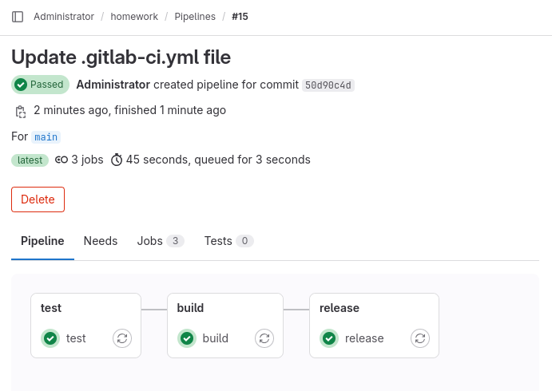

# Домашнее задание к занятию "`GitLab`" - `Журавлев Николай`
### Задание 1

**Что нужно сделать:**

1. Разверните GitLab локально, используя Vagrantfile и инструкцию, описанные в [этом репозитории](https://github.com/netology-code/sdvps-materials/tree/main/gitlab).   
2. Создайте новый проект и пустой репозиторий в нём.
3. Зарегистрируйте gitlab-runner для этого проекта и запустите его в режиме Docker. Раннер можно регистрировать и запускать на той же виртуальной машине, на которой запущен GitLab.

В качестве ответа в репозиторий шаблона с решением добавьте скриншоты с настройками раннера в проекте.

### Решение 1





---

### Задание 2

**Что нужно сделать:**

1. Запушьте [репозиторий](https://github.com/netology-code/sdvps-materials/tree/main/gitlab) на GitLab, изменив origin. Это изучалось на занятии по Git.
2. Создайте .gitlab-ci.yml, описав в нём все необходимые, на ваш взгляд, этапы.

В качестве ответа в шаблон с решением добавьте: 
   
 * файл gitlab-ci.yml для своего проекта или вставьте код в соответствующее поле в шаблоне; 
 * скриншоты с успешно собранными сборками.

### Решение 2
 
```yaml
variables:
  IMAGE_NAME: $CI_REGISTRY/$CI_PROJECT_PATH/app
  CSS: $CI_COMMIT_SHORT_SHA

stages:
  - test
  - build
  - release

test:
  stage: test
  image: golang:1.17
  script: 
   - go test .

build:
  stage: build
  script:
    - docker build -t $IMAGE_NAME:$CSS -f Dockerfile .

release:
  stage: release
  before_script:
    - echo "$CI_JOB_TOKEN" | docker login -u gitlab-ci-token --password-stdin $CI_REGISTRY
  script:
    - docker push $IMAGE_NAME:$CSS
```


---

### Задание 3*

Измените CI так, чтобы:

 - этап сборки запускался сразу, не дожидаясь результатов тестов;
 - тесты запускались только при изменении файлов с расширением *.go.

В качестве ответа добавьте в шаблон с решением файл gitlab-ci.yml своего проекта или вставьте код в соответсвующее поле в шаблоне.

### Решение 3*

```yaml
variables:
  IMAGE_NAME: $CI_REGISTRY/$CI_PROJECT_PATH/app
  CSS: $CI_COMMIT_SHORT_SHA

stages:
  - test
  - build
  - release

test:
  stage: test
  image: golang:1.17
  script: 
   - go test .
  only:
    changes:
      - "*.go"

build:
  stage: build
  script:
    - docker build -t $IMAGE_NAME:$CSS -f Dockerfile .

release:
  stage: release
  before_script:
    - echo "$CI_JOB_TOKEN" | docker login -u gitlab-ci-token --password-stdin $CI_REGISTRY
  script:
    - docker push $IMAGE_NAME:$CSS

```