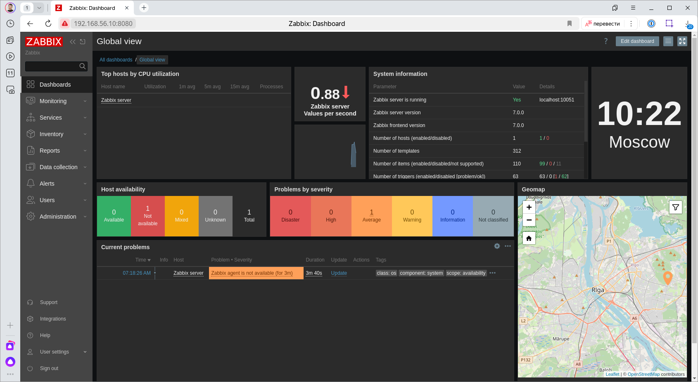
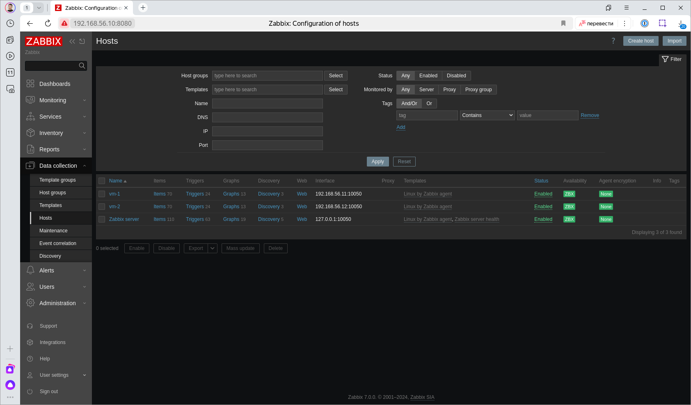
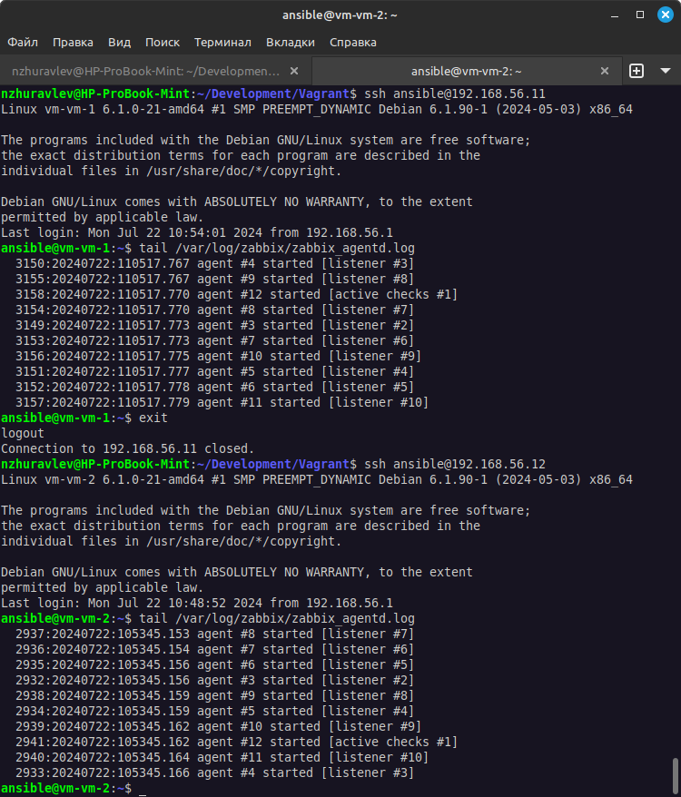
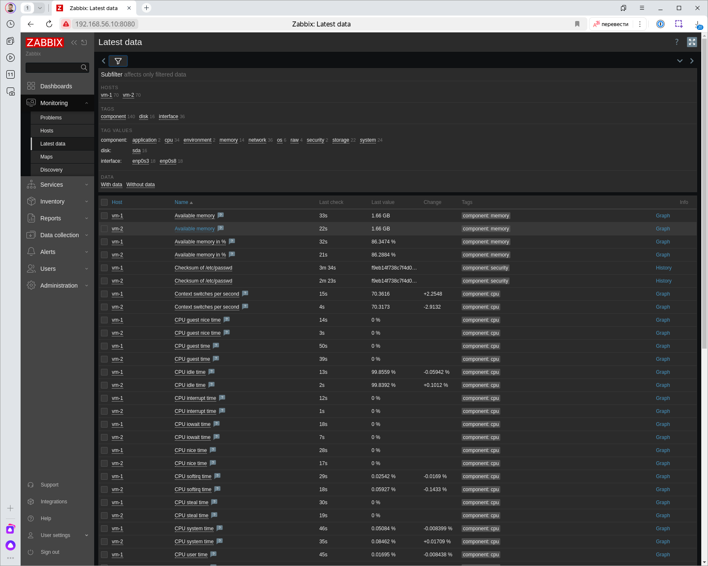
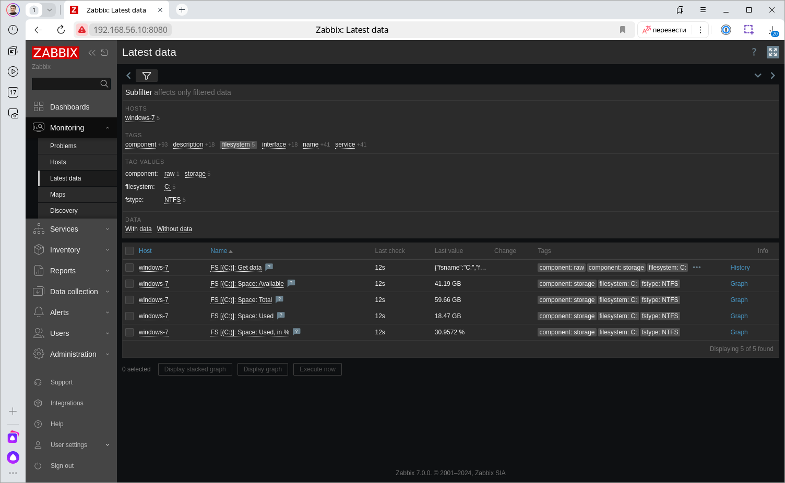

# Домашнее задание к занятию "`Система мониторинга Zabbix`" - `Журавлев Николай`
### Задание 1 

Установите Zabbix Server с веб-интерфейсом.

#### Процесс выполнения
1. Выполняя ДЗ, сверяйтесь с процессом отражённым в записи лекции.
2. Установите PostgreSQL. Для установки достаточна та версия, что есть в системном репозитороии Debian 11.
3. Пользуясь конфигуратором команд с официального сайта, составьте набор команд для установки последней версии Zabbix с поддержкой PostgreSQL и Apache.
4. Выполните все необходимые команды для установки Zabbix Server и Zabbix Web Server.

#### Требования к результаты 
1. Прикрепите в файл README.md скриншот авторизации в админке.
2. Приложите в файл README.md текст использованных команд в GitHub.

### Решение 1



```bash
sudo apt update
sudo apt install postgresql
sudo -u postgres createuser --pwprompt zabbix
sudo -u postgres createdb -O zabbix zabbix

wget https://repo.zabbix.com/zabbix/7.0/debian/pool/main/z/zabbix-release/zabbix-release_7.0-2+debian12_all.deb
sudo dpkg -i zabbix-release_7.0-2+debian12_all.deb
sudo apt update
sudo apt install zabbix-server-pgsql zabbix-frontend-php php8.2-pgsql zabbix-nginx-conf zabbix-sql-scripts

zcat /usr/share/zabbix-sql-scripts/postgresql/server.sql.gz | sudo -u zabbix psql zabbix

# Далее внесены изменения в конфигурационные файлы
# /etc/zabbix/zabbix_server.conf - установлен пароль подключения к базе данных
# /etc/zabbix/nginx.conf - порт и имя сервера

systemctl restart zabbix-server nginx php8.2-fpm
systemctl enable zabbix-server nginx php8.2-fpm

```
---

### Задание 2 

Установите Zabbix Agent на два хоста.

#### Процесс выполнения
1. Выполняя ДЗ, сверяйтесь с процессом отражённым в записи лекции.
2. Установите Zabbix Agent на 2 вирт.машины, одной из них может быть ваш Zabbix Server.
3. Добавьте Zabbix Server в список разрешенных серверов ваших Zabbix Agentов.
4. Добавьте Zabbix Agentов в раздел Configuration > Hosts вашего Zabbix Servera.
5. Проверьте, что в разделе Latest Data начали появляться данные с добавленных агентов.

#### Требования к результаты 
1. Приложите в файл README.md скриншот раздела Configuration > Hosts, где видно, что агенты подключены к серверу
2. Приложите в файл README.md скриншот лога zabbix agent, где видно, что он работает с сервером
3. Приложите в файл README.md скриншот раздела Monitoring > Latest data для обоих хостов, где видны поступающие от агентов данные.
4. Приложите в файл README.md текст использованных команд в GitHub

### Решение 2





```bash
wget https://repo.zabbix.com/zabbix/7.0/debian/pool/main/z/zabbix-release/zabbix-release_7.0-2+debian12_all.deb
sudo dpkg -i zabbix-release_7.0-2+debian12_all.deb
sudo apt update
sudo apt install zabbix-agent
sudo vim /etc/zabbix/zabbix_agentd.conf # изменены настройки агента (указан ip сервера)
sudo systemctl restart zabbx-agent
sudo systemctl enable zabbix-agent

```

---
## Задание 3 со звёздочкой*
Установите Zabbix Agent на Windows (компьютер) и подключите его к серверу Zabbix.

#### Требования к результаты 
1. Приложите в файл README.md скриншот раздела Latest Data, где видно свободное место на диске C:

### Решение 3*

--- 
