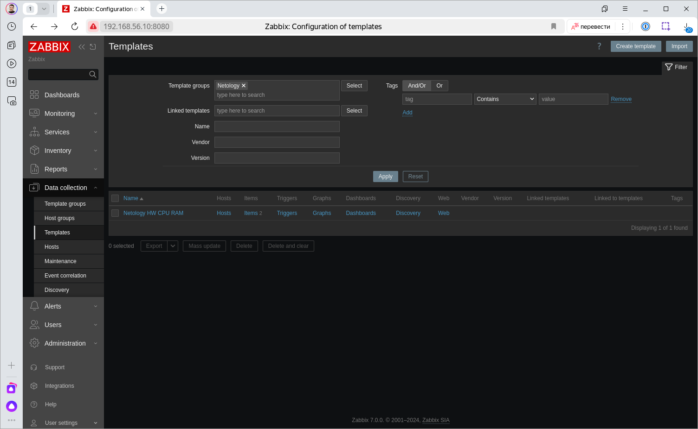
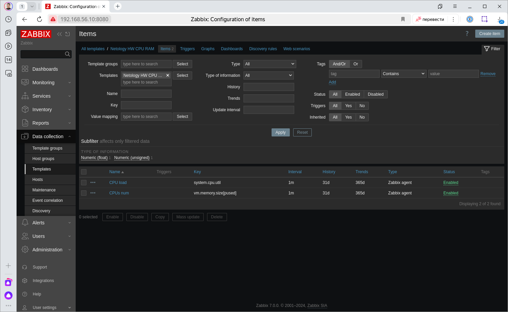
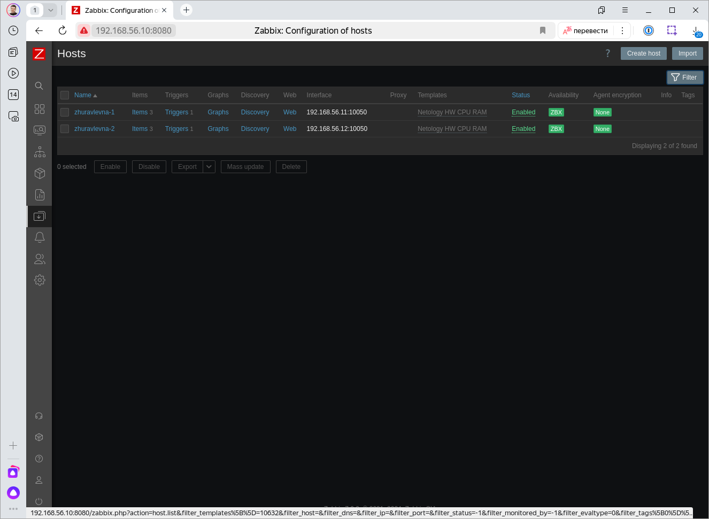
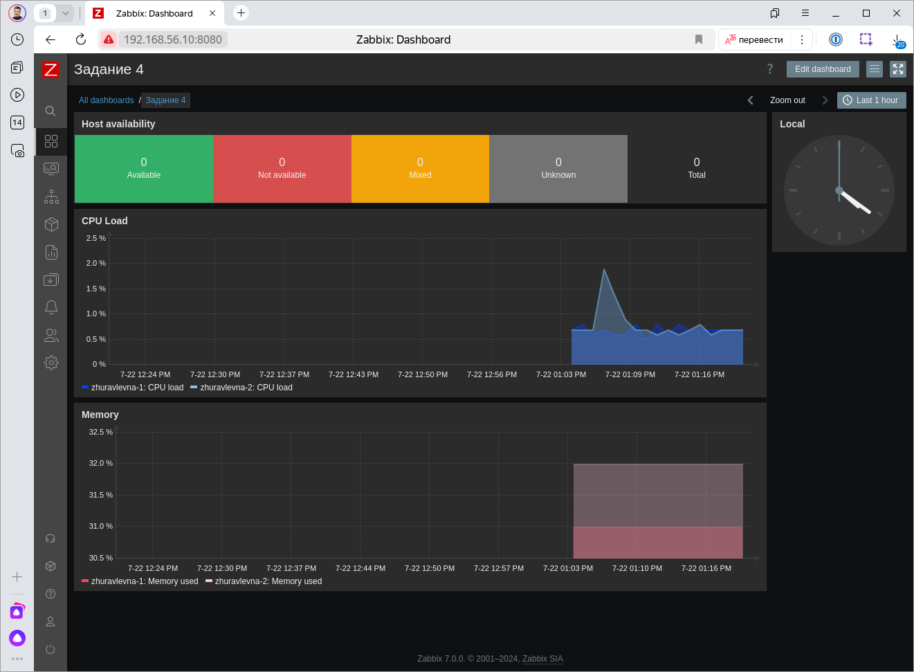
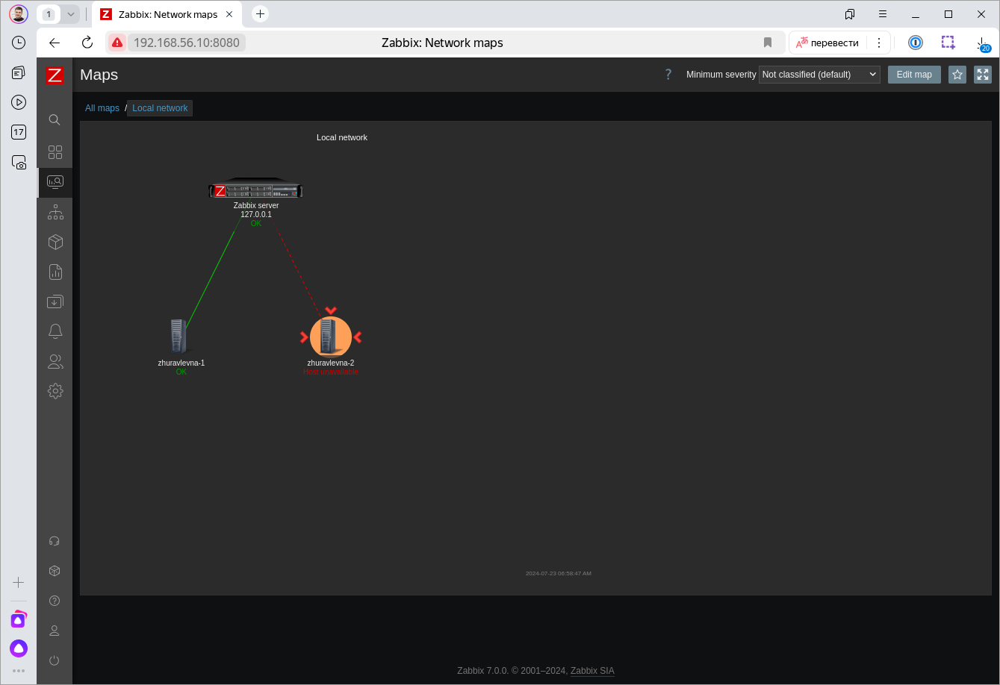
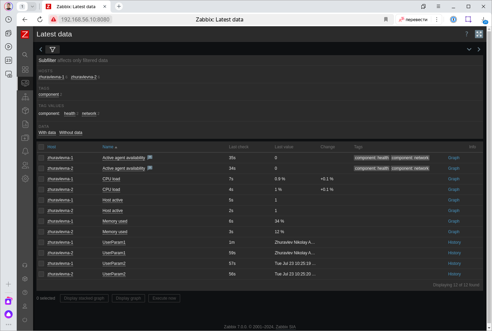
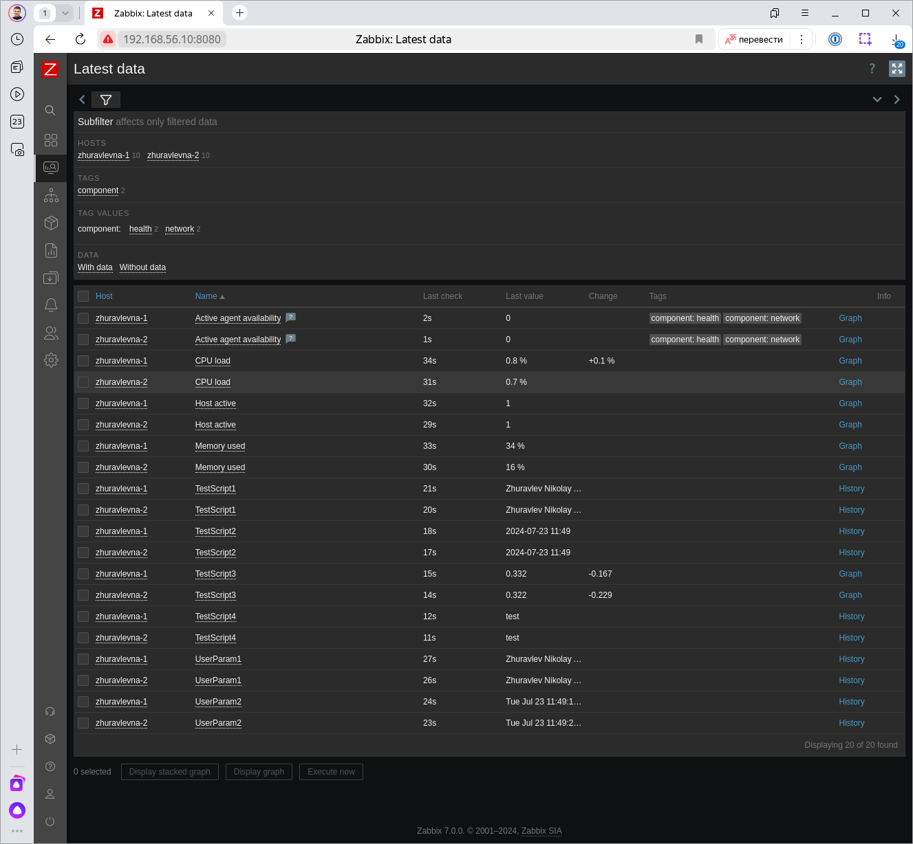
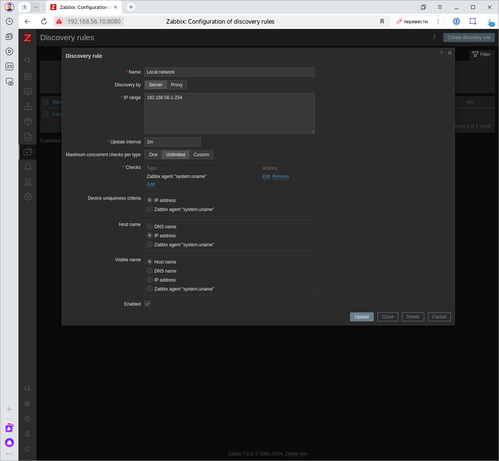
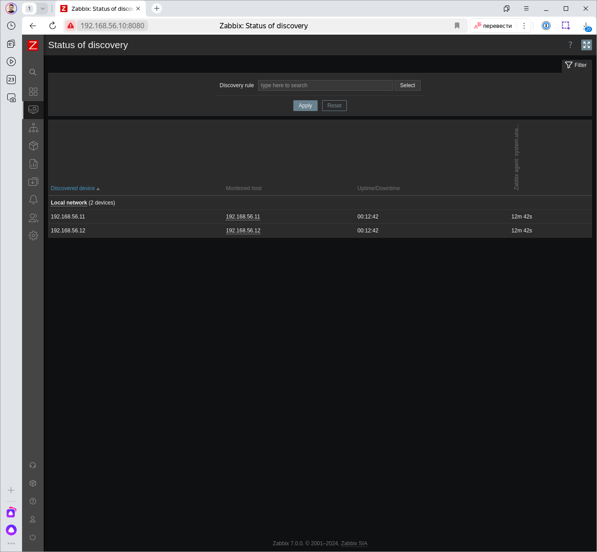

# Домашнее задание к занятию "`Система мониторинга Zabbix. Часть 2`" - `Журавлев Николай`

### Задание 1
Создайте свой шаблон, в котором будут элементы данных, мониторящие загрузку CPU и RAM хоста.

#### Процесс выполнения
1. Выполняя ДЗ сверяйтесь с процессом отражённым в записи лекции.
2. В веб-интерфейсе Zabbix Servera в разделе Templates создайте новый шаблон
3. Создайте Item который будет собирать информацию об загрузке CPU в процентах
4. Создайте Item который будет собирать информацию об загрузке RAM в процентах

#### Требования к результату
- [ ] Прикрепите в файл README.md скриншот страницы шаблона с названием «Задание 1»

### Решение 1




 ---

### Задание 2
Добавьте в Zabbix два хоста и задайте им имена <фамилия и инициалы-1> и <фамилия и инициалы-2>. Например: ivanovii-1 и ivanovii-2.

#### Процесс выполнения
1. Выполняя ДЗ сверяйтесь с процессом отражённым в записи лекции.
2. Установите Zabbix Agent на 2 виртмашины, одной из них может быть ваш Zabbix Server
3. Добавьте Zabbix Server в список разрешенных серверов ваших Zabbix Agentов
4. Добавьте Zabbix Agentов в раздел Configuration > Hosts вашего Zabbix Servera
5. Прикрепите за каждым хостом шаблон Linux by Zabbix Agent
6. Проверьте что в разделе Latest Data начали появляться данные с добавленных агентов

#### Требования к результату
- [ ] Результат данного задания сдавайте вместе с заданием 3

 ---

### Задание 3
Привяжите созданный шаблон к двум хостам. Также привяжите к обоим хостам шаблон Linux by Zabbix Agent.

#### Процесс выполнения
1. Выполняя ДЗ сверяйтесь с процессом отражённым в записи лекции.
2. Зайдите в настройки каждого хоста и в разделе Templates прикрепите к этому хосту ваш шаблон
3. Так же к каждому хосту привяжите шаблон Linux by Zabbix Agent
4. Проверьте что в раздел Latest Data начали поступать необходимые данные из вашего шаблона

#### Требования к результату
- [ ] Прикрепите в файл README.md скриншот страницы хостов, где будут видны привязки шаблонов с названиями «Задание 2-3». Хосты должны иметь зелёный статус подключения

### Решение 2-3

 ---

### Задание 4
Создайте свой кастомный дашборд.

#### Процесс выполнения
1. Выполняя ДЗ сверяйтесь с процессом отражённым в записи лекции.
2. В разделе Dashboards создайте новый дашборд
3. Разместите на нём несколько графиков на ваше усмотрение.

#### Требования к результату
- [ ] Прикрепите в файл README.md скриншот дашборда с названием «Задание 4»

### Решение 4


 ---

### Задание 5* со звёздочкой
Создайте карту и расположите на ней два своих хоста.

#### Процесс выполнения
1. Настройте между хостами линк.
2. Привяжите к линку триггер, связанный с agent.ping одного из хостов, и установите индикатором сработавшего триггера красную пунктирную линию.
3. Выключите хост, чей триггер добавлен в линк. Дождитесь срабатывания триггера.

#### Требования к результату
- [ ] Прикрепите в файл README.md скриншот карты, где видно, что триггер сработал, с названием «Задание 5» 

### Решение 5*


 ---

### Задание 6* со звёздочкой
Создайте UserParameter на bash и прикрепите его к созданному вами ранее шаблону. Он должен вызывать скрипт, который:
- при получении 1 будет возвращать ваши ФИО,
- при получении 2 будет возвращать текущую дату.

#### Требования к результату
- [ ] Прикрепите в файл README.md код скрипта, а также скриншот Latest data с результатом работы скрипта на bash, чтобы был виден результат работы скрипта при отправке в него 1 и 2
 
### Решение 6*
```bash
UserParameter=netology[*], if [ $1 -eq 1 ]; then echo 'Zhuravlev Nikolay Andreevich'; elif [ $1 -eq 2 ]; then echo $(date); fi
```


 ---

### Задание 7* со звёздочкой
Доработайте Python-скрипт из лекции, создайте для него UserParameter и прикрепите его к созданному вами ранее шаблону. 
Скрипт должен:
- при получении 1 возвращать ваши ФИО,
- при получении 2 возвращать текущую дату,
- делать всё, что делал скрипт из лекции.

- [ ] Прикрепите в файл README.md код скрипта в Git. Приложите в Git скриншот Latest data с результатом работы скрипта на Python, чтобы были видны результаты работы скрипта при отправке в него 1, 2, -ping, а также -simple_print.*
 
 ### Решение 7*
 ```python
#!/bin/python3
import sys
import os
import re
import datetime

if len(sys.argv) < 2:
    print("Need set args")
    sys.exit(1)

if (sys.argv[1] == "1"):
    print("Zhuravlev Nikolay Andreevich")
elif (sys.argv[1] == "2"):
    print(datetime.datetime.now().strftime("%Y-%m-%d %H:%M"))
elif (sys.argv[1] == '-ping'):
    if(len(sys.argv) < 3):
        print("Need set ping target")
        sys.exit(1)
    result=os.popen("ping -c 1 " + sys.argv[2]).read()
    result=re.findall(r"time=(.*) ms", result)
    print(result[0])
elif (sys.argv[1] == '-simple_print'):
    if (len(sys.argv) < 3):
        print("Need set print text")
        sys.exit(1)
    print(sys.argv[2])
else:
    print(f"unknown input: {sys.argv[1]}")
 ```


 ---

### Задание 8* со звёздочкой

Настройте автообнаружение и прикрепление к хостам созданного вами ранее шаблона.

#### Требования к результату
- [ ] Прикрепите в файл README.md скриншот правила обнаружения, а также скриншот страницы Discover, где видны оба хоста.*

### Решение 8*



 ---

### Задание 9* со звёздочкой

Доработайте скрипты Vagrant для 2-х агентов, чтобы они были готовы к автообнаружению сервером, а также имели на борту разработанные вами ранее параметры пользователей.

- [ ] Приложите в GitHub файлы Vagrantfile и zabbix-agent.sh.*

### Решение 9*

Vagrantfile
```ruby
# -*- mode: ruby -*-
# vi: set ft=ruby :

$ssh_username = "ansible"
$box_name = "debian-ansible"

Vagrant.configure("2") do |config|
  (3..4).each do |i|
    name = i
    config.vm.define "#{name}" do |node|
      node.vm.box_check_update = false
      node.vm.box = $box_name
      node.ssh.username = $ssh_username
      node.vm.network "private_network", ip: "192.168.56.1#{i}"
      node.vm.provider "virtualbox" do |vb|
        vb.memory = "2048"
        vb.cpus = "2"
        vb.name = "vagrant-vm-#{name}"
      end
      node.vm.hostname = "vm-#{name}"
      node.vm.provision "shell", inline: <<-SHELL
        cat /vagrant/.ssh/id.pub >> /home/ansible/.ssh/authorized_keys
        apt update
        apt install -y python3
        /vagrant/zabbix-agent.sh
      SHELL
    end
  end
end
```
zabbix-agent.sh
```bash
#!/bin/bash
wget https://repo.zabbix.com/zabbix/7.0/debian/pool/main/z/zabbix-release/zabbix-release_7.0-2+debian12_all.deb
dpkg -i zabbix-release_7.0-2+debian12_all.deb
apt update
apt install -y zabbix-agent
cp /vagrant/test_script.* /etc/zabbix/zabbix_agentd.d/
sed -i.ori 's#Server=127.0.0.1#Server=192.168.56.10#' /etc/zabbix/zabbix_agentd.conf
sed -i.ori 's#ServerActive=127.0.0.1#ServerActive=192.168.56.10#' /etc/zabbix/zabbix_agentd.conf
systemctl restart zabbix-agent
systemctl enable zabbix-agent
```