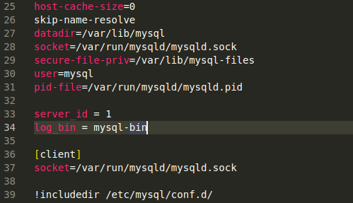
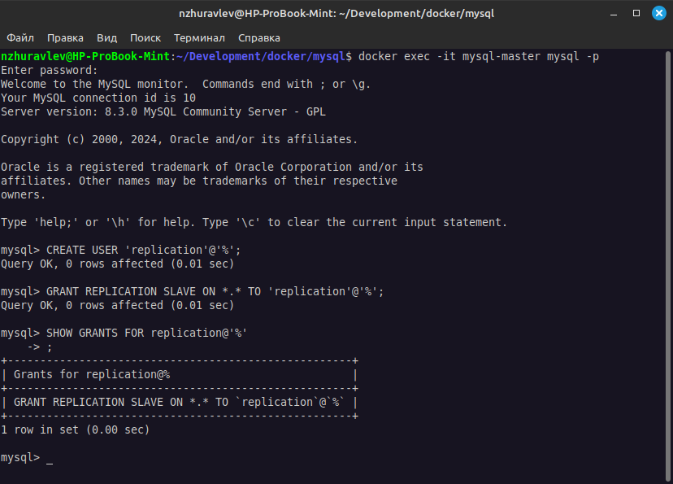
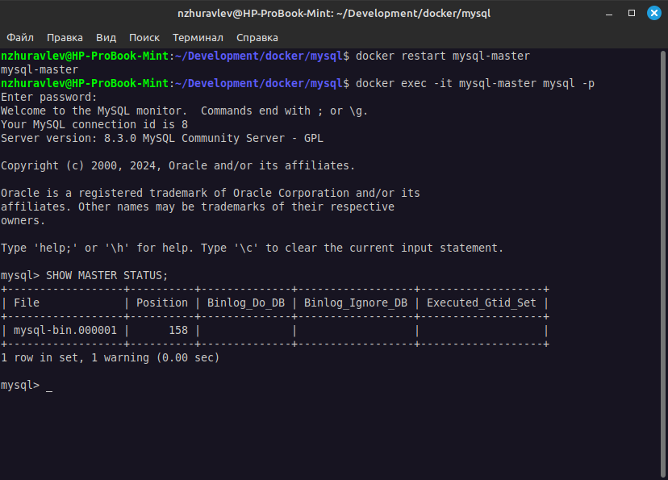

# Домашнее задание к занятию "`Репликация и масштабирование. Часть 1`" - `Журавлев Николай`

### Задание 1

На лекции рассматривались режимы репликации master-slave, master-master, опишите их различия.

*Ответить в свободной форме.*

### Решение 1

* **Чтение данных** - и в том и в другом случае чтение может осуществляться с любой реплики
* **Запись данных** - в случае с master-slave можем писать только в мастер, в случае с master-master можем писать в любую из реплик
* **Разрешение конфликтов** - в случае с master-slave не требуется, т.к. данные могут изменяться только на master-реплике, в случае с master-master, возможен одновременный доступ на изменение одних и тех же данных с любой реплики, соответственно требуются механизмы разрешения конфликтов
* **Синхронизация данных** - в случае с master-slave, slave-реплики периодически получают обновления от master (асинхронно или синхронно), в случае с master-master осуществляется двусторонняя репликация, что в свою очередь требует механизмов разрешения конфликтов (об этом в предыдущем пункте)
* **Отказоустойчивость** - в случае с master-slave при выходе из стороя master-реплики, требуется время на переключение одной из slave-реплик в режим мастера, в случае с master-master никакого простоя не будет.

---

### Задание 2

Выполните конфигурацию master-slave репликации, примером можно пользоваться из лекции.

*Приложите скриншоты конфигурации, выполнения работы: состояния и режимы работы серверов.*

### Решение 2

#### Запуск контейнеров с mysql (master, slave)

#### Конфиг mysql мастер-сервера

#### Добавление пользователя

#### Вывод информации по мастер-серверу

#### Конфиг слейв-сервера

#### Настройка и запуск репликации на слейв-сервере + вывод статуса репликации

#### Вывод информации об имеющихся репликах на мастер-сервере.

#### Тестирование

---

### Задание 3* 

Выполните конфигурацию master-master репликации. Произведите проверку.

*Приложите скриншоты конфигурации, выполнения работы: состояния и режимы работы серверов.*

---
