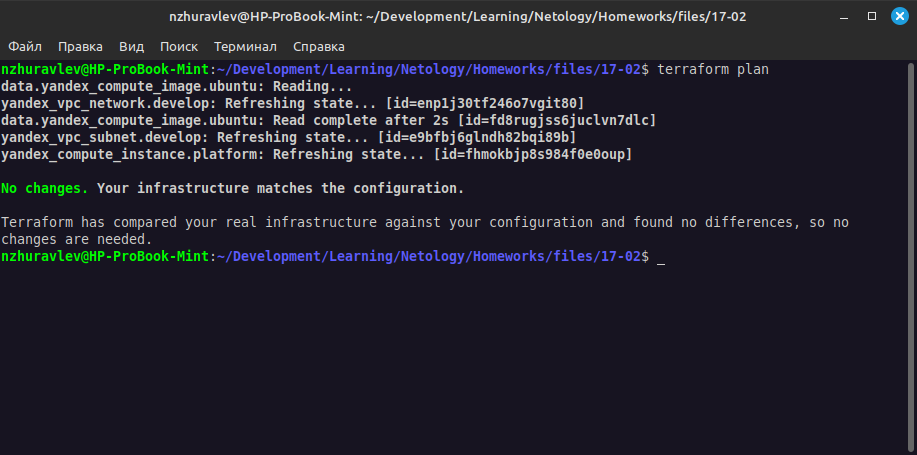

# Домашнее задание к занятию "`Резервное копирование`" - `Журавлев Николай`

### Задание 1
- Составьте команду rsync, которая позволяет создавать зеркальную копию домашней директории пользователя в директорию `/tmp/backup`
- Необходимо исключить из синхронизации все директории, начинающиеся с точки (скрытые)
- Необходимо сделать так, чтобы rsync подсчитывал хэш-суммы для всех файлов, даже если их время модификации и размер идентичны в источнике и приемнике.
- На проверку направить скриншот с командой и результатом ее выполнения

### Решение 1

`rsync -a --delete --checksum --exclude='.*/' ~/ /tmp/backup/`


---

### Задание 2
- Написать скрипт и настроить задачу на регулярное резервное копирование домашней директории пользователя с помощью rsync и cron.
- Резервная копия должна быть полностью зеркальной
- Резервная копия должна создаваться раз в день, в системном логе должна появляться запись об успешном или неуспешном выполнении операции
- Резервная копия размещается локально, в директории `/tmp/backup`
- На проверку направить файл crontab и скриншот с результатом работы утилиты.

### Решение 2

#### Файл скрипта
```bash
#!/bin/bash

SOURCE_DIR="/home/ansible"
BACKUP_DIR="/tmp/backup"
LOG_FILE="/var/log/backup.log"

rsync -a --delete $SOURCE_DIR $BACKUP_DIR >> $LOG_FILE 2>&1

if [ $? -eq 0 ]; then
  echo "$(date '+%Y-%m-%d %H:%M:%S') - Backup successfully completed" >> $LOG_FILE
else
  echo "$(date '+%Y-%m-%d %H:%M:%S') - Backup failed" >> $LOG_FILE
fi
```

#### Задание cron
```
0 0 * * * root /root/backup
```

Временно настроил на ежеминутное срабатывание, чтобы получить лог. На скриншоте видно содержимое лога и содержимое папки с бэкапом.



---

### Задание 3*
- Настройте ограничение на используемую пропускную способность rsync до 1 Мбит/c
- Проверьте настройку, синхронизируя большой файл между двумя серверами
- На проверку направьте команду и результат ее выполнения в виде скриншота

### Решение 3*

```bash
rsync -av --progress --bwlimit=125 --delete ./bigfile  ansible@192.168.56.11:~/
# 125 КБайт/с эквивалентно 1 Мбит/с
```


---

### Задание 4*
- Напишите скрипт, который будет производить инкрементное резервное копирование домашней директории пользователя с помощью rsync на другой сервер
- Скрипт должен удалять старые резервные копии (сохранять только последние 5 штук)
- Напишите скрипт управления резервными копиями, в нем можно выбрать резервную копию и данные восстановятся к состоянию на момент создания данной резервной копии.
- На проверку направьте скрипт и скриншоты, демонстрирующие его работу в различных сценариях.

### Решение 4*

#### Скрипт резервного копирования
```bash
#!/bin/bash
SOURCE_DIR="/home/ansible/"
DESTINATION_SERVER="ansible@192.168.56.10"
DESTINATION_DIR="/tmp/backup"
CUR_DATE=$(date '+%Y-%m-%d')
CURRENT_BACKUP="$DESTINATION_DIR/$CUR_DATE"
PREVIOUS_BACKUP=$DESTINATION_DIR/$(ssh $DESTINATION_SERVER "ls -t $DESTINATION_DIR | head -n 1")
LOG_FILE="/var/log/backup.log"

ssh $DESTINATION_SERVER "mkdir -p $CURRENT_BACKUP"

rsync -a --delete --link-dest=$PREVIOUS_BACKUP $SOURCE_DIR $DESTINATION_SERVER:$CURRENT_BACKUP >> $LOG_FILE 2>&1

if [ $? -eq 0 ]; then
  echo "$(date '+%Y-%m-%d %H:%M:%S') - Incremental backup successfully completed" >> $LOG_FILE
else
  echo "$(date '+%Y-%m-%d %H:%M:%S') - Incremental backup failed" >> $LOG_FILE
  exit 1
fi

ssh $DESTINATION_SERVER "cd $DESTINATION_DIR && ls -t | tail -n +6 | xargs rm -rf"
```

#### Скрипт восстановления из резевной копии
```bash
#!/bin/bash

DESTINATION_SERVER="ansible@192.168.56.10"
DESTINATION_DIR="/tmp/backup"
RESTORE_DIR="/home/ansible/"

echo "Available backups:"
ssh $DESTINATION_SERVER "ls -t $DESTINATION_DIR"

read -p "Enter the date of the backup you want to restore (YYYY-MM-DD): " BACKUP_DATE
if [ -z "${BACKUP_DATE}" ]; then
  echo "Backup date is empty"
  exit 1
fi

if ssh $DESTINATION_SERVER "[ -d $DESTINATION_DIR/$BACKUP_DATE ]"; then
  echo "Restoring backup from $BACKUP_DATE..."
  rsync -av $DESTINATION_SERVER:$DESTINATION_DIR/$BACKUP_DATE/ $RESTORE_DIR
  if [ $? -eq 0 ]; then
    echo "Restore completed successfully!"
  else
    echo "Restore failed."
  fi
else
  echo "Backup not found for the specified date."
  exit 1
fi
```
#### На скриншоте видно:
1. вывод списка существующих бэкапов
2. создание нового бэкапа
3. вывод списка существующих бэкапов (видно, что наиболее старый бэкап был удален)
4. вывод информации о файле в домашней директории
5. удаление файла
6. попытка вывода информации о несуществующем (удаленном) файле
7. восстановление бэкапа
8. вывод информации о восстановленном файле
9. вывод содержимого лога скрипта

> В процессе тестирования переменная CUR_DATE в скрипте backup.sh задавалась вручную
> 
> В файле лога видны строки "Backup successfully completed", данные строки добавляет другой скрипт из задания 2 (запускается кроном для проверки с периодиченостью в 1 минуту)


---