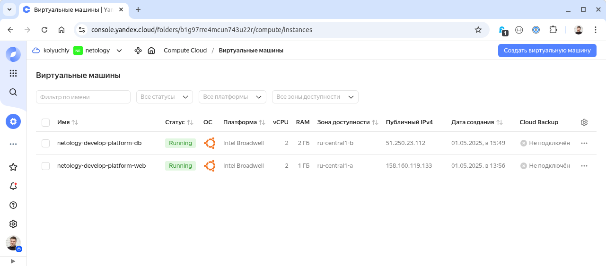

# Домашнее задание к занятию "`Кластеризация и балансировка нагрузки`" - `Журавлев Николай`

### Задание 1
- Запустите два simple python сервера на своей виртуальной машине на разных портах
- Установите и настройте HAProxy, воспользуйтесь материалами к лекции по [ссылке](2/)
- Настройте балансировку Round-robin на 4 уровне.
- На проверку направьте конфигурационный файл haproxy, скриншоты, где видно перенаправление запросов на разные серверы при обращении к HAProxy.

### Решение 1
```ini 
global
    log /dev/log	local0
    log /dev/log	local1 notice
    chroot /var/lib/haproxy
    stats socket /run/haproxy/admin.sock mode 660 level admin
    stats timeout 30s
    user haproxy
    group haproxy
    daemon

defaults
    log	global
    mode	tcp
    timeout connect 5000
    timeout client  50000
    timeout server  50000

frontend sps
    bind :8080
    balance roundrobin
    default_backend sps_backend

backend sps_backend
    server sps1 127.0.0.1:9001
    server sps2 127.0.0.1:9002
```


---

### Задание 2
- Запустите три simple python сервера на своей виртуальной машине на разных портах
- Настройте балансировку Weighted Round Robin на 7 уровне, чтобы первый сервер имел вес 2, второй - 3, а третий - 4
- HAproxy должен балансировать только тот http-трафик, который адресован домену example.local
- На проверку направьте конфигурационный файл haproxy, скриншоты, где видно перенаправление запросов на разные серверы при обращении к HAProxy c использованием домена example.local и без него.

### Решение 2

```ini
global
    log /dev/log	local0
    log /dev/log	local1 notice
    chroot /var/lib/haproxy
    stats socket /run/haproxy/admin.sock mode 660 level admin
    stats timeout 30s
    user haproxy
    group haproxy
    daemon

defaults
    log	global
    mode	http
    timeout connect 5000
    timeout client  50000
    timeout server  50000

frontend sps
    bind :80
    acl example.local hdr(host) -i example.local
    use_backend sps_backend if example.local

backend sps_backend
    balance roundrobin
    server sps1 127.0.0.1:9001 weight 2
    server sps2 127.0.0.1:9002 weight 3
    server sps3 127.0.0.1:9003 weight 4
```


---

### Задание 3*
- Настройте связку HAProxy + Nginx как было показано на лекции.
- Настройте Nginx так, чтобы файлы .jpg выдавались самим Nginx (предварительно разместите несколько тестовых картинок в директории /var/www/), а остальные запросы переадресовывались на HAProxy, который в свою очередь переадресовывал их на два Simple Python server.
- На проверку направьте конфигурационные файлы nginx, HAProxy, скриншоты с запросами jpg картинок и других файлов на Simple Python Server, демонстрирующие корректную настройку.

### Решение 3*

#### Конфиг nginx
```ini
server {
  listen 80;
  listen [::]:80;

  root /var/www/html;
  index index.html;

  # обработка изображений - просто отдаем из корневой папки
  location ~ \.(?:jpg|jpeg|gif|png|ico) {
    try_files $uri $uri/ =404;
  }

  # обработка всех путей - проксируем на haproxy
  location / {
    proxy_pass http://localhost:8080;
  }
}
```

#### Конфиг haproxy
```ini
global
  log /dev/log	local0
  log /dev/log	local1 notice
  chroot /var/lib/haproxy
  stats socket /run/haproxy/admin.sock mode 660 level admin
  stats timeout 30s
  user haproxy
  group haproxy
  daemon

defaults
  log	global
  mode	http
  timeout connect 5000
  timeout client  50000
  timeout server  50000

frontend sps
  bind :8080
  default_backend sps_backend

backend sps_backend
  mode http
  balance roundrobin
  server sps1 127.0.0.1:9001
  server sps2 127.0.0.1:9002
```


* цикл с запросами к корню по 80 порту (nginx проксирует на haproxy)
* 2 запроса изображений /1.jpg и /2.jpg по 80 порту (nginx отдает сам)
* цикл с запросами к корню по порту 8080 (прямое обращение к haproxy для подтверждения его работоспособности)
  


---

### Задание 4*
- Запустите 4 simple python сервера на разных портах.
- Первые два сервера будут выдавать страницу index.html вашего сайта example1.local (в файле index.html напишите example1.local)
- Вторые два сервера будут выдавать страницу index.html вашего сайта example2.local (в файле index.html напишите example2.local)
- Настройте два бэкенда HAProxy
- Настройте фронтенд HAProxy так, чтобы в зависимости от запрашиваемого сайта example1.local или example2.local запросы перенаправлялись на разные бэкенды HAProxy
- На проверку направьте конфигурационный файл HAProxy, скриншоты, демонстрирующие запросы к разным фронтендам и ответам от разных бэкендов.

### Решение 4*

```ini
global
  log /dev/log	local0
  log /dev/log	local1 notice
  chroot /var/lib/haproxy
  stats socket /run/haproxy/admin.sock mode 660 level admin
  stats timeout 30s
  user haproxy
  group haproxy
  daemon

defaults
  log	global
  mode	http
  timeout connect 5000
  timeout client  50000
  timeout server  50000

frontend sps
  bind :80
  acl ACL_example1 hdr(host) -i example1.local
  acl ACL_example2 hdr(host) -i example2.local

  use_backend example1 if ACL_example1
  use_backend example2 if ACL_example2

backend example1
  mode http
  server sps1 127.0.0.1:9001
  server sps2 127.0.0.1:9002

backend example2
  mode http
  server sps3 127.0.0.1:9003
  server sps4 127.0.0.1:9004
```

Дополнительно в файлах index.html добавил указание номера SPS сервера, чтобы было видно, какой именно сервер отдает файл.

На скриншоте
  1. Цикл запросов к example1.local
  1. Цикл запросов к example2.local
  1. Прямые запросы к SPS по портам 

