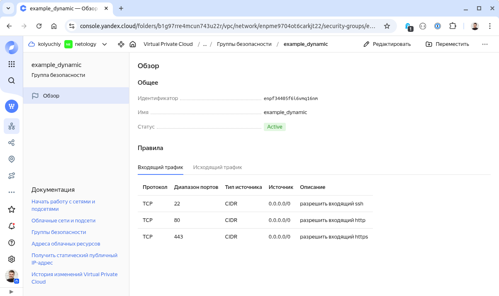
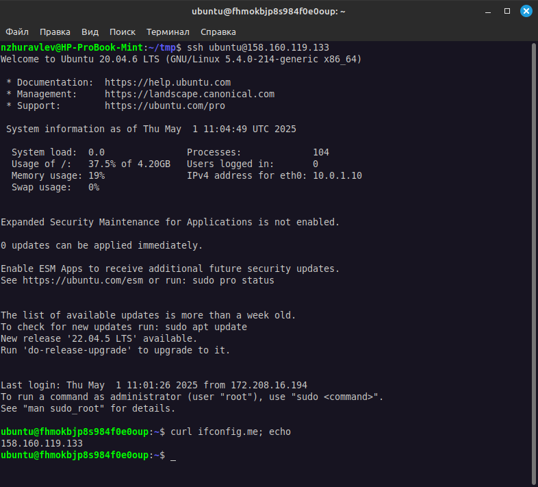
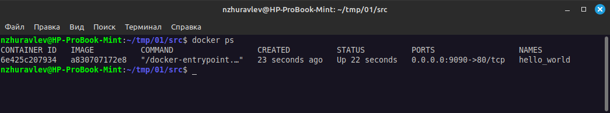

# Домашнее задание к занятию "`Введение в Terraform`" - `Журавлев Николай`

### Задание 1

1. Перейдите в каталог [**src**](https://github.com/netology-code/ter-homeworks/tree/main/01/src). Скачайте все необходимые зависимости, использованные в проекте. 
2. Изучите файл **.gitignore**. В каком terraform-файле, согласно этому .gitignore, допустимо сохранить личную, секретную информацию?(логины,пароли,ключи,токены итд)
3. Выполните код проекта. Найдите  в state-файле секретное содержимое созданного ресурса **random_password**, пришлите в качестве ответа конкретный ключ и его значение.
4. Раскомментируйте блок кода, примерно расположенный на строчках 29–42 файла **main.tf**.
Выполните команду ```terraform validate```. Объясните, в чём заключаются намеренно допущенные ошибки. Исправьте их.
5. Выполните код. В качестве ответа приложите: исправленный фрагмент кода и вывод команды ```docker ps```.
6. Замените имя docker-контейнера в блоке кода на ```hello_world```. Не перепутайте имя контейнера и имя образа. Мы всё ещё продолжаем использовать name = "nginx:latest". Выполните команду ```terraform apply -auto-approve```.
Объясните своими словами, в чём может быть опасность применения ключа  ```-auto-approve```. Догадайтесь или нагуглите зачем может пригодиться данный ключ? В качестве ответа дополнительно приложите вывод команды ```docker ps```.
8. Уничтожьте созданные ресурсы с помощью **terraform**. Убедитесь, что все ресурсы удалены. Приложите содержимое файла **terraform.tfstate**. 
9. Объясните, почему при этом не был удалён docker-образ **nginx:latest**. Ответ **ОБЯЗАТЕЛЬНО НАЙДИТЕ В ПРЕДОСТАВЛЕННОМ КОДЕ**, а затем **ОБЯЗАТЕЛЬНО ПОДКРЕПИТЕ** строчкой из документации [**terraform провайдера docker**](https://docs.comcloud.xyz/providers/kreuzwerker/docker/latest/docs).  (ищите в классификаторе resource docker_image )

### Решение 1



2. Секретная информация будет в любом случае сохраняться в tfstate, каких-то специальных файлов для хранения секретов не указано, но теоретически, можно хранить в любом месте, которое не будет синхронизироваться с удаленным репозиторием.
Соответственно можем хранить в любом файле, который начинается на .terraform кроме .terraformrc, в любом файле внутри папки .terrafrom (независимо от вложенности)

3. `"result": "j6eU4eTOtgOgwNr4"`

4. 1. Все ресурсы должны иметь 2 метки - тип и имя (у ресурса "образ" не указано имя, указываем, например `nginx`)
   2. Имя ресурса должно начинаться с буквы или знака подчеркивания. (Переименовываем `1nginx` в `nginx`)
   3. Не декларирован ресурс `random_string_FAKE` (неверное название ресурса, убираем `_FAKE`)
   4. Объект не имеет атрибута. (Неверное указание атрибута. Меняем `resulT` на `result`)

5. 

```bash
resource "docker_image" "nginx"{
  name         = "nginx:latest"
  keep_locally = true
}

resource "docker_container" "nginx" {
  image = docker_image.nginx.image_id
  name  = "example_${random_password.random_string.result}"

  ports {
    internal = 80
    external = 9090
  }
}
```



6. Опасность ключа -auto-approve в том, что изменения применяются автомиатически, т.е. какая-либо ошибка в конфиге может привести, например, к удалению критичных ресурсов, т.е. мы не проверяем, что будет изменено, а просто применяем все изменения.

Логично препдоложить, что данный ключ просто необходим для автоматизации (работа с инфраструктурой через CI)



8. Содержимое `terraform.tfstate`
```
{
  "version": 4,
  "terraform_version": "1.11.4",
  "serial": 26,
  "lineage": "b1426f0b-1a22-9c86-bd2f-8b6b809bc218",
  "outputs": {},
  "resources": [],
  "check_results": null
}
```
9. Образ не был удален потому, что в конфигурации образа используется параметр `keep_locally` со значением `true`
Описание параметра в документации:
```
keep_locally (Boolean) If true, then the Docker image won't be deleted on destroy operation. If this is false, it will delete the image from the docker local storage on destroy operation.
```

---

### Задание 2*

1. Создайте в облаке ВМ. Сделайте это через web-консоль, чтобы не слить по незнанию токен от облака в github(это тема следующей лекции). Если хотите - попробуйте сделать это через terraform, прочитав документацию yandex cloud. Используйте файл ```personal.auto.tfvars``` и гитигнор или иной, безопасный способ передачи токена!
2. Подключитесь к ВМ по ssh и установите стек docker.
3. Найдите в документации docker provider способ настроить подключение terraform на вашей рабочей станции к remote docker context вашей ВМ через ssh.
4. Используя terraform и  remote docker context, скачайте и запустите на вашей ВМ контейнер ```mysql:8``` на порту ```127.0.0.1:3306```, передайте ENV-переменные. Сгенерируйте разные пароли через random_password и передайте их в контейнер, используя интерполяцию из примера с nginx.(```name  = "example_${random_password.random_string.result}"```  , двойные кавычки и фигурные скобки обязательны!) 
```
    environment:
      - "MYSQL_ROOT_PASSWORD=${...}"
      - MYSQL_DATABASE=wordpress
      - MYSQL_USER=wordpress
      - "MYSQL_PASSWORD=${...}"
      - MYSQL_ROOT_HOST="%"
```

6. Зайдите на вашу ВМ , подключитесь к контейнеру и проверьте наличие секретных env-переменных с помощью команды ```env```. Запишите ваш финальный код в репозиторий.

### Решение 2*

Код задания - [Задание 2](./files)

---

### Задание 3*
1. Установите [opentofu](https://opentofu.org/)(fork terraform с лицензией Mozilla Public License, version 2.0) любой версии
2. Попробуйте выполнить тот же код с помощью ```tofu apply```, а не terraform apply.

### Решение 3*


---