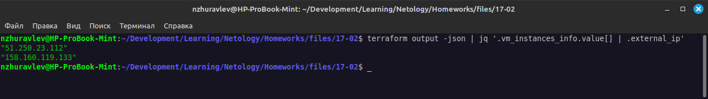

# Домашнее задание к занятию "`Основы Terraform. Yandex Cloud`" - `Журавлев Николай`


### Задание 1
В качестве ответа всегда полностью прикладывайте ваш terraform-код в git.
Убедитесь что ваша версия **Terraform** ~>1.8.4

1. Изучите проект. В файле variables.tf объявлены переменные для Yandex provider.
2. Создайте сервисный аккаунт и ключ. [service_account_key_file](https://terraform-provider.yandexcloud.net).
3. Сгенерируйте новый или используйте свой текущий ssh-ключ. Запишите его открытую(public) часть в переменную **vms_ssh_public_root_key**.
4. Инициализируйте проект, выполните код. Исправьте намеренно допущенные синтаксические ошибки. Ищите внимательно, посимвольно. Ответьте, в чём заключается их суть.
5. Подключитесь к консоли ВМ через ssh и выполните команду ``` curl ifconfig.me```.
Примечание: К OS ubuntu "out of a box, те из коробки" необходимо подключаться под пользователем ubuntu: ```"ssh ubuntu@vm_ip_address"```. Предварительно убедитесь, что ваш ключ добавлен в ssh-агент: ```eval $(ssh-agent) && ssh-add``` Вы познакомитесь с тем как при создании ВМ создать своего пользователя в блоке metadata в следующей лекции.;
6. Ответьте, как в процессе обучения могут пригодиться параметры ```preemptible = true``` и ```core_fraction=5``` в параметрах ВМ.

В качестве решения приложите:

- скриншот ЛК Yandex Cloud с созданной ВМ, где видно внешний ip-адрес;
- скриншот консоли, curl должен отобразить тот же внешний ip-адрес;
- ответы на вопросы.

### Решение 1
3. Значение переменной указал в файле variables.auto.tfvars + добавил *.tfvars в .gitignore, чтобы не светить в репозитории данные, даже публичный ключ.

4. 1. Не существует платформы `standart-v4`, нужно выбрать одну из существующих, например `standard-v1`
   2. Количество ядер создаваемой машины не соответствует разрешенному, в standard-v1 можно установить минимум 2 ядра, максимум 32


---

### Задание 2

1. Замените все хардкод-**значения** для ресурсов **yandex_compute_image** и **yandex_compute_instance** на **отдельные** переменные. К названиям переменных ВМ добавьте в начало префикс **vm_web_** .  Пример: **vm_web_name**.
2. Объявите нужные переменные в файле variables.tf, обязательно указывайте тип переменной. Заполните их **default** прежними значениями из main.tf. 
3. Проверьте terraform plan. Изменений быть не должно. 

### Решение 2

```hcl
resource "yandex_compute_instance" "platform" {
  name        = var.vm_web_name
  platform_id = var.vm_web_platform_id
  resources {
    cores         = var.vm_web_cores
    memory        = var.vm_web_memory
    core_fraction = var.vm_web_core_fraction
  }
  ...
}
```

```hcl
variable "vm_web_name" {
  type        = string
  default     = "netology-develop-platform-web"
  description = "VM name"
}

variable "vm_web_platform_id" {
  type        = string
  default     = "standard-v1"
  description = "VM platform id"
}

variable "vm_web_cores" {
  type        = number
  default     = 2
  description = "VM cores"
}
variable "vm_web_memory" {
  type        = number
  default     = 1
  description = "VM memory"
}

variable "vm_web_core_fraction" {
  type        = number
  default     = 5
  description = "VM core fraction"
}
```


---

### Задание 3

1. Создайте в корне проекта файл 'vms_platform.tf' . Перенесите в него все переменные первой ВМ.
2. Скопируйте блок ресурса и создайте с его помощью вторую ВМ в файле main.tf: **"netology-develop-platform-db"** ,  ```cores  = 2, memory = 2, core_fraction = 20```. Объявите её переменные с префиксом **vm_db_** в том же файле ('vms_platform.tf').  ВМ должна работать в зоне "ru-central1-b"
3. Примените изменения.

### Решение 3


---

### Задание 4

1. Объявите в файле outputs.tf **один** output , содержащий: instance_name, external_ip, fqdn для каждой из ВМ в удобном лично для вас формате.(без хардкода!!!)
2. Примените изменения.

В качестве решения приложите вывод значений ip-адресов команды ```terraform output```.

### Решение 4


```js
vm_instances_info = {
  "db" = {
    "external_ip" = "51.250.23.112"
    "fqdn" = "epd2o73sgnsvqva0ghgi.auto.internal"
    "name" = "netology-develop-platform-db"
  }
  "web" = {
    "external_ip" = "158.160.119.133"
    "fqdn" = "fhmokbjp8s984f0e0oup.auto.internal"
    "name" = "netology-develop-platform-web"
  }
}
```
Можно показать только ip-адреса (по условиям задания не совсем понятно, какой именно результат нужен)



---

### Задание 5

1. В файле locals.tf опишите в **одном** local-блоке имя каждой ВМ, используйте интерполяцию ${..} с НЕСКОЛЬКИМИ переменными по примеру из лекции.
2. Замените переменные внутри ресурса ВМ на созданные вами local-переменные.
3. Примените изменения.

### Решение 5

Не совсем понятно само задание, нужно ли сделать одну локальную переменную "name" и создавать ресурсы в зависимости от того, какие внешние переменные подклчены, или сделать 2 локальные переменные для каждой виртуальной машины с интерполяцией.
Пока сделал так:
Файл locals.tf
```hcl
locals {
  web = "netology-${var.env}-${var.project}-web"
  db  = "netology-${var.env}-${var.project}-db"
}
```
В файл variables.tf добвлены env и project.
```hcl
...
variable "env" {
  type    = string
  default = "develop"
}
variable "project" {
  type    = string
  default = "platform"
}
```

---

### Задание 6

1. Вместо использования трёх переменных  ".._cores",".._memory",".._core_fraction" в блоке  resources {...}, объедините их в единую map-переменную **vms_resources** и  внутри неё конфиги обеих ВМ в виде вложенного map(object).  
   ```
   пример из terraform.tfvars:
   vms_resources = {
     web={
       cores=2
       memory=2
       core_fraction=5
       hdd_size=10
       hdd_type="network-hdd"
       ...
     },
     db= {
       cores=2
       memory=4
       core_fraction=20
       hdd_size=10
       hdd_type="network-ssd"
       ...
     }
   }
   ```
3. Создайте и используйте отдельную map(object) переменную для блока metadata, она должна быть общая для всех ваших ВМ.
   ```
   пример из terraform.tfvars:
   metadata = {
     serial-port-enable = 1
     ssh-keys           = "ubuntu:ssh-ed25519 AAAAC..."
   }
   ```  
  
5. Найдите и закоментируйте все, более не используемые переменные проекта.
6. Проверьте terraform plan. Изменений быть не должно.

### Решение 6
Предпочел бы metadata сделать через locals с интерполяцией, чтобы не хранить в репозитории открытый ключ.

terraform.tfvars
```hcl
vms_resources = {
  web = {
    cores         = 2,
    memory        = 1,
    core_fraction = 5,
    platform_id   = "standard-v1",
  },
  db = {
    cores         = 2,
    memory        = 2,
    core_fraction = 20,
    platform_id   = "standard-v1",
  }
}

metadata = {
  serial-port-enable = 1
  ssh-keys           = "ubuntu:***"
}
```

Пример vm из main.tf
```hcl
resource "yandex_compute_instance" "netology-develop-platform-db" {
  name        = local.db
  platform_id = var.vms_resources.web.platform_id
  zone        = var.vm_db_zone
  resources {
    cores         = var.vms_resources.db.cores
    memory        = var.vms_resources.db.memory
    core_fraction = var.vms_resources.db.core_fraction
  }
  boot_disk {
    initialize_params {
      image_id = data.yandex_compute_image.ubuntu.image_id
    }
  }
  scheduling_policy {
    preemptible = true
  }
  network_interface {
    subnet_id = yandex_vpc_subnet.develop_b.id
    nat       = true
  }

  metadata = var.metadata
}

```

И variables.tf
```hcl
...
variable "vms_resources" {
  type = map(object({
    cores         = number
    memory        = number
    core_fraction = number
    platform_id   = string
  }))
}

variable "metadata" {
  type = object({
    serial_port_enable = number
    ssh_keys           = string
  })
}
```
---

### Задание 7*

Изучите содержимое файла console.tf. Откройте terraform console, выполните следующие задания: 

1. Напишите, какой командой можно отобразить **второй** элемент списка test_list.
2. Найдите длину списка test_list с помощью функции length(<имя переменной>).
3. Напишите, какой командой можно отобразить значение ключа admin из map test_map.
4. Напишите interpolation-выражение, результатом которого будет: "John is admin for production server based on OS ubuntu-20-04 with X vcpu, Y ram and Z virtual disks", используйте данные из переменных test_list, test_map, servers и функцию length() для подстановки значений.

**Примечание**: если не догадаетесь как вычленить слово "admin", погуглите: "terraform get keys of map"

В качестве решения предоставьте необходимые команды и их вывод.

### Решение 7*
1.  ```hcl
    local.test_list.1
    ```

2.  ```
    length(local.test_list)
    ```

3.  ```
    keys(local.test_map)[0]

    ```

2.  ```hcl
    "${local.test_map.admin} is ${keys(local.test_map)[0]} for ${keys(local.servers)[2]} server based on OS ${local.servers.production.image} with ${local.servers.production.cpu} vcpu, ${local.servers.production.ram} rma and ${length(local.servers.production.disks)} virtual disks"
    ```


---

### Задание 8*
1. Напишите и проверьте переменную test и полное описание ее type в соответствии со значением из terraform.tfvars:
```
test = [
  {
    "dev1" = [
      "ssh -o 'StrictHostKeyChecking=no' ubuntu@62.84.124.117",
      "10.0.1.7",
    ]
  },
  {
    "dev2" = [
      "ssh -o 'StrictHostKeyChecking=no' ubuntu@84.252.140.88",
      "10.0.2.29",
    ]
  },
  {
    "prod1" = [
      "ssh -o 'StrictHostKeyChecking=no' ubuntu@51.250.2.101",
      "10.0.1.30",
    ]
  },
]
```
2. Напишите выражение в terraform console, которое позволит вычленить строку "ssh -o 'StrictHostKeyChecking=no' ubuntu@62.84.124.117" из этой переменной.

### Решение 8*

1.  Можно описать через объект `list(object{....})`, можно так
    ```
    variable "test" {
      type  = list(map(list(string)))
    }
    ```

2.  ```
    var.test[0].dev1[0]
    ```

---

### Задание 9*

Используя инструкцию https://cloud.yandex.ru/ru/docs/vpc/operations/create-nat-gateway#tf_1, настройте для ваших ВМ nat_gateway. Для проверки уберите внешний IP адрес (nat=false) у ваших ВМ и проверьте доступ в интернет с ВМ, подключившись к ней через serial console. Для подключения предварительно через ssh измените пароль пользователя: ```sudo passwd ubuntu```

### Решение 9*

Добавлено создание шлюза и таблицы маршрутизации + в подсети добавлено использование созданной таблицы маршрутизации. Единственное - название шлюза и таблицы маршрутизации не вынесено в переменные.
Все результаты [здесь](./files)